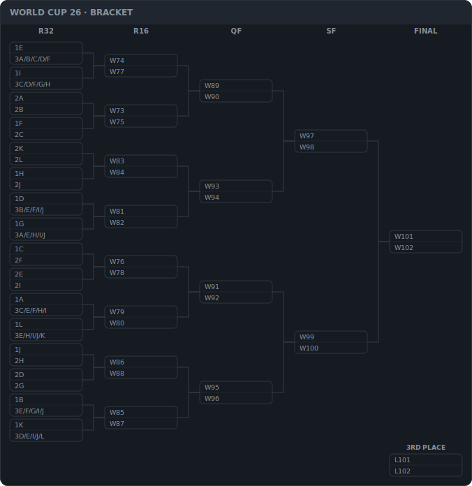

# mdmodule
机械设计/产品结构设计的技术博客，目标：简单设计好产品。

<!-- WC26:START -->

<!-- WC26:END -->

# 最新地址
博客园：https://www.cnblogs.com/zjc9915

博客园目录页：https://www.cnblogs.com/zjc9915/p/9240968.html

微信公众号：mdmodule；

# 简介
明确目标：简单设计好产品（Simple design Good product）

拥有成体系的结构设计方法，包括基础的机械绘图，标准化管理，GD&T，DFMA，DFMEA，公差分析，仿真和各种实例研究，自己的理念等。

# 后续
完成自己的目标，找到简单设计好产品的办法。包括且不限于：完成机械设计体系，搭建公共标准库，设计简单的机械工具，给出实际可操作的方法，还有AI辅助（最近想搞的方法）等。
